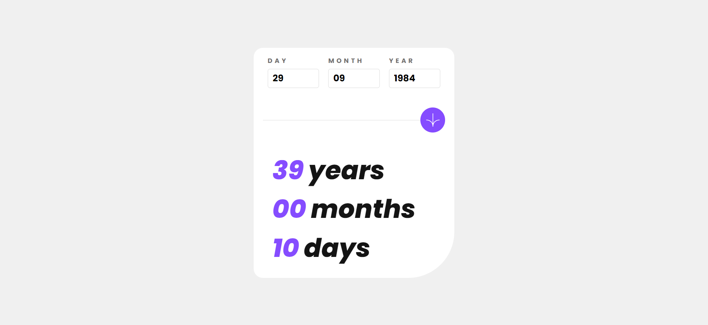
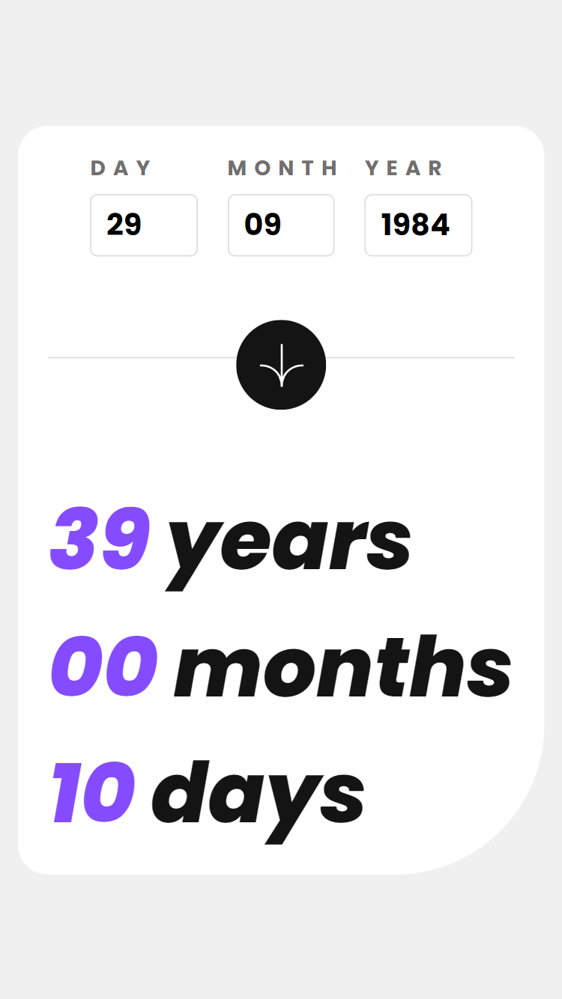

# Frontend Mentor - Age calculator app solution

This is a solution to the [Age calculator app challenge on Frontend Mentor](https://www.frontendmentor.io/challenges/age-calculator-app-dF9DFFpj-Q). Frontend Mentor challenges help you improve your coding skills by building realistic projects. 

## Overview

### The challenge

Users should be able to:

- View an age in years, months, and days after submitting a valid date through the form
- Receive validation errors if:
  - Any field is empty when the form is submitted
  - The day number is not between 1-31
  - The month number is not between 1-12
  - The year is in the future
  - The date is invalid e.g. 31/04/1991 (there are 30 days in April)
- View the optimal layout for the interface depending on their device's screen size
- See hover and focus states for all interactive elements on the page

### Screenshot




### Links

- [Solution URL](https://github.com/luisamlopez/age-calculator-app)
- [Live Site URL](luisamlopezg-age-calculator-app.netlify.app)
## My process

### Built with

- Semantic HTML5 markup
- CSS custom properties
- Flexbox
- Javascript
- Mobile-first workflow
- [React](https://reactjs.org/) - JS library
- [Formik](https://formik.org/) - Form library for React 
- [Yup](https://www.npmjs.com/package/yup) - Javascript schema builder for value parsing and validation

### What I learned

With the following code I learned how to use Formik and Yup to validate the form for leap years and the number of days in a month. I had to use different examples from the internet to make the test function work. 

```js
const schema = yup.object().shape({
  day: yup
    .number()
    .moreThan(0, "Please enter a valid day")
    .lessThan(32, "Please enter a valid day")
    .test(
      "day",
      "Please enter a valid day for the month",
      (value, { parent }) => {
        const { month, year } = parent;
        const daysInMonth = new Date(year, month, 0).getDate(); // Get the number of days in the selected month
        return value <= daysInMonth;
      }
    )
    .required("This field is required"),
  month: yup
    .number()
    .moreThan(0, "Please enter a valid month")
    .lessThan(13, "Please enter a valid month")
    .required("This field is required"),
  year: yup
    .number()
    .moreThan(1899, "The year must be greater than 1899")
    .lessThan(2024, "The year must be less than 2023")
    .required("This field is required"),
});
```

### Useful resources

- [Formik](https://formik.org/docs) - Form library for React 
- [Yup](https://www.npmjs.com/package/yup#getting-started) - Javascript schema builder for value parsing and validation 

## Author

- Frontend Mentor - [@luisamlopez](https://www.frontendmentor.io/profile/luisamlopez)
